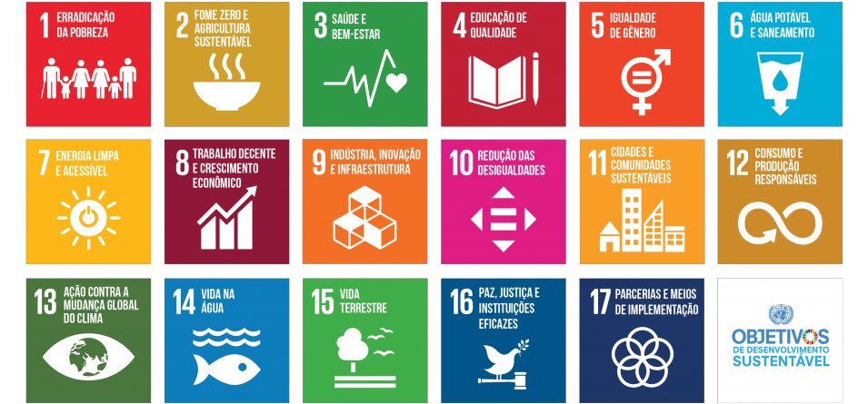

 

<h1>Índice de consciência sustentável no Brasil</h1>

 

# 

# Apresentação

Desafios globais, como erradicação da fome, agricultura sustentável, saúde e bem-estar, educação de qualidade, acesso à agua potável e saneamento, cidades e comunidades sustentáveis, consumo e produção responsáveis, mudança climática global e preservação da vida na água e na terra, entre outros, exigem, mais do que nunca, uma mudança urgente em nosso estilo de vida, bem como uma transformação em nosso modo de pensar e agir.

Em 2015, os países das Nações Unidas adotaram a Agenda 2030 para o Desenvolvimento Sustentável. Trata-se de um plano de ação previamente acordado pelos Estados-membros, que convoca governos, a sociedade civil e o setor privado a se comprometerem com a agenda proposta, protegendo e preparando as gerações futuras, para alcançarmos o mundo que queremos em 2030.

A educação é explicitamente formulada como um objetivo independente, o Objetivo de Desenvolvimento Sustentável 4 (ODS 4), que visa a “assegurar a educação inclusiva e equitativa de qualidade, e promover oportunidades de aprendizagem ao longo da vida” , sendo, portanto, um fator essencial para atingir todos os demais ODS.

# Objetivos

O índice tem como objetivo estabelecer os ODS como ferramenta útil e efetiva para a gestão pública e a ação política nos municípios brasileiros. O monitoramento de indicadores permite guiar as prioridades dos governos locais de acordo com os desafios identificados a partir da análise de dados.

Finalmente, outro princípio que motiva este projeto é a necessidade de adaptar o painel de monitoramento dos objetivos e metas estipulados pela ONU ao contexto local. Os ODS são um quadro global para transformar sociedades, mas os desafios diferem segundo a região. Ademais, a ação e a incidência política do poder público municipal são diferentes daquelas adotadas nos governos estaduais e federais

# Metodologia
Mudanças de comportamento, pensamento, valores e ações requerem processos pedagógicos que, pautados na sustentabilidade, provoquem nas pessoas o desejo e/ou a necessidade de mudar a si mesmas e o mundo. Nesse sentido, a abordagem metodológica tem uma função crucial na consecução dos objetivos de aprendizagem almejados.

### Fundamentação dos dados

O cálculo do índice de consciência sustentável, consiste em utilizar como base os indicadores de cada uma das 17 trilhas dos ODS no Brasil, tendo em vista que eles possuem uma grande abrangência no âmbito de **Sustentabilidade** no geral, e assim, demonstrar uma medida fundamentada a partir de um somatório ponderado nos indicadores dos ODS.

### Critérios de medição

A medida fundamentada a partir de um somatório ponderado nos indicadores dos ODS.

Onde:

**ics** dado em (%)

Vale ressaltar que o conjunto de valores são normalizados de acordo com o **Z-score**, onde faz-se o cálculo da média e do desvio padrão. Desse modo, para um determinado conjunto de valores aplicasse a seguinte fórmula:

    valores_normalizados = (valores - media) / desvio_padrao

Resultando um conjunto normalizado com média 0 com desvio padrão de 1.

### Apresentação dos Indicadores
Os indicadores utilizados foram os próprios Objetivos de Desenvolvimento Sustentável (ODS) junto às suas métricas de como são medidos pela ONU. Sendo eles:

A lista detalhada (em inglês) para cada ODS utilizada está em [Indicators](https://github.com/ValterNiloJr/ics-brasil/blob/master/Indicadores.md)

# Desenvolvimento

A estrutura criada foi dividida em 4 (quatro) partes: 3 (três) classes e 1 (um) gerenciador.

O [Database]() é responsável por toda a leitura e tratamento estrutural dos dados, tais como filtros por grupos específicos, remoção de dados faltantes e obtenção dos metadados que serão utilizados nos demais módulos.

O [Classifier]() é uma representação de um classificador, que pode ser implementado por meio da estruturação de um crawler para buscar os dados relevantes ou mesmo a implementação de algoritmos de **machine learning** e **redes neurais** para classificar os dados da melhor forma possível. No entanto, para fins de didáticos, foi utilizado uma classificação simples feita a partir de uma análise orgânica.

A [Graphics]() lida com a parte de exibição dos dados por meios gráficos. No entanto, ela não recebeu a devida atenção até o momento, tento em vista que a maior parte da visualização dos dados analisados estão disponíveis no site da ONU apresentado nas [referências](#visualização-dos-indicadores).

Por fim, o [Gerenciador]() permite a apresentação, de forma simplificada, de toda a metodologia utilizada em cada etapa do processo até chegar no valor final do ICS.

# Conclusões

Como o objetivo da análise é retornar uma métrica que diz respeito a consciência sustentável de uma determinada região, os dados foram filtrados fazendo uma correlação entre parâmetros relacionados, como: Sexo, Idade e Localização. Definindo um conjunto de dados mais próximo do que se deseja medir.

Portanto, após todas as etapas definidas na metodologia, chegou-se à um valor de ICS para o Brasil de **24.16%**. Mesmo conciderando uma análise razoável dos dados disponibilizados pela ONU o resultado ainda assim, é preocupante. Para contextualizar melhor o cenário que o Brasil se encontra no âmbito **Sustentabilidade** foi apresentado um [*Storytelling*]() trazendo outros dados relevantes e a disposição de pessoas para solucionar um problema latente: **a vida no planeta**.

# Referências

- https://brasil.un.org/pt-br/sdgs

- https://brasil.un.org/sites/default/files/2022-04/ONUBrasil_RelatorioAnual_2021_web.pdf

    ### Visualização dos indicadores
    - https://unstats.un.org/sdgs/dataportal/countryprofiles/BRA

# Dataset

### Filtro:

### Data Series 
> Todos os 17 ODS | (Selected 625 of 625)

### Geographic Areas | Countries
> Todos os Países | (346 of 346)

### Period | Years
> 2000 - 2022

### Link: https://unstats.un.org/sdgs/dataportal/database

&nbsp;

# Autor
Valter Nilo Alcantara de Oliveira Junior

# 
> [Voltar ao topo](#apresentação)

